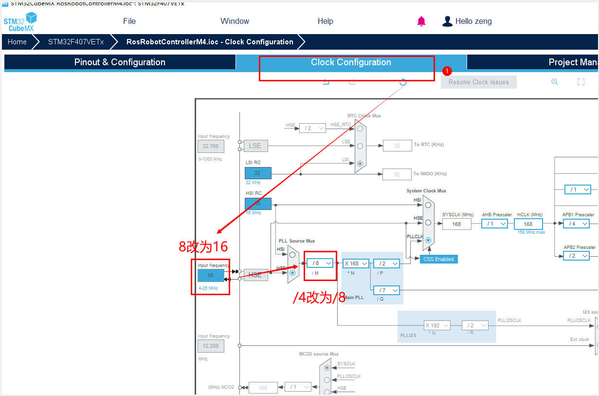

## RRCv1.2工程升级操作步骤
**注意：  
1.在执行以下步骤前，请先将当前待升级的工程复制粘贴一份，保留一份备用副本，以防出现一些未知错误导致工程不可逆的受到影响  
2.对于单独介绍某一外设的教学例程，我们的工程设计比较简单，以下某些步骤如果无法找到对应待操作的对象，直接跳过该步骤即可  
3.在cubeMX重新生成代码时，工程main.c文件中一些没有放置在指定代码编写区的代码会被重置覆盖，只需要将备份工程的main.c文件拷贝过来替换即可**
### 1.打开工程cubemx工程文件
    在工程“时钟树”选项卡中，将晶振频率和预分频倍数修改

### 2.修改信号量
    双击图标5中的IMU信号量“mpu6050_data_ready”,将其重命名为“IMU_data_ready”

    按下图配置新增信号量“serial_servo_rx_complete”(如果有就跳过)

### 3.重新生成代码
    如下图，点击右上方的按键重新生成工程代码

### 4.将运行脚本复制至如下工程路径
    我们以其中一个工程为例，将“RRC升级脚本”文件夹复制到工程路径下(在这一级路径，包含“MDK-ARM”、"Hiwonder"等文件夹，可以对照确认一下)
**“MDK-ARM”、"Hiwonder"文件夹第6步要用，记一下这两个文件夹**

### 5.运行脚本一键替换适配文件
    进入“RRC升级脚本”文件夹，双击运行脚本文件
  

    如果一切配置顺利，会出现如下的输出内容

**注：以上输出报错信息是正常的，在RRC早期外设例程中，功能比较简单，有些文件并没有配置，因此我们的升级脚本只包含了共通的配置文件，在升级脚本文件夹中包含“选择性移植文件”子文件夹。接下来具体介绍**  
**在以下情况，需要将“选择性移植文件”子文件夹内部文件取出放置在上级路径，并重新执行脚本：①使用了RRC主控的其他产品项目工程  ②RRC程序分析第十五节及之后小节的课程**

### 6.打开keil工程文件
    在“MDK-ARM”文件夹中，找到keil工程文件（.uvprojx格式），双击打开。

    进入工程，在左侧工程栏中“Hiwonder\Peripherals”文件夹，右键单击，点击“加入已存在的文件”，在工程相同路径中，找到下图三个文件并添加

    进入工程，在左侧工程栏中“Hiwonder\Porting”文件夹，右键单击，点击“加入已存在的文件”，在工程相同路径中，找到下图文件并添加

    按下图配置，修改Keil编译器版本并修改对应的编译配置

